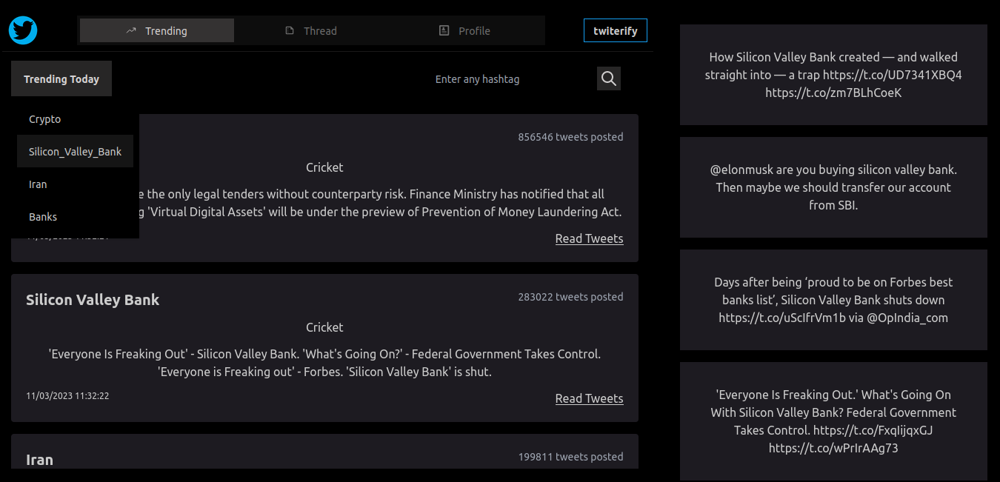
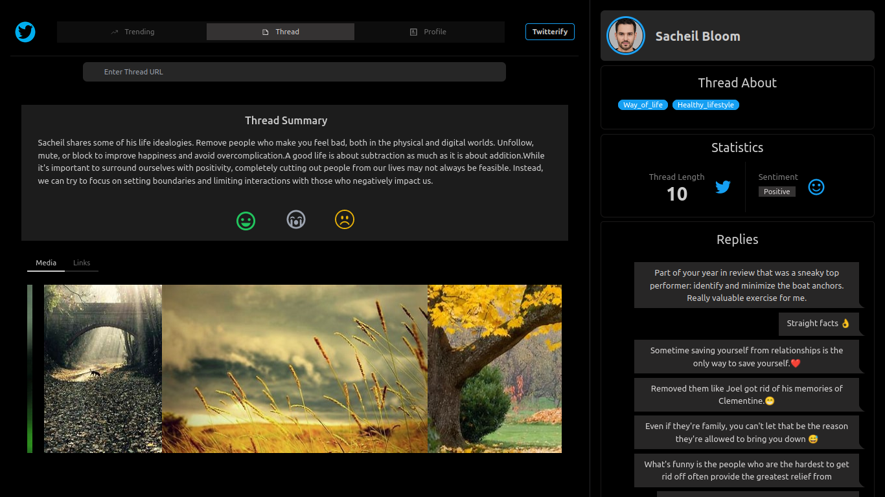
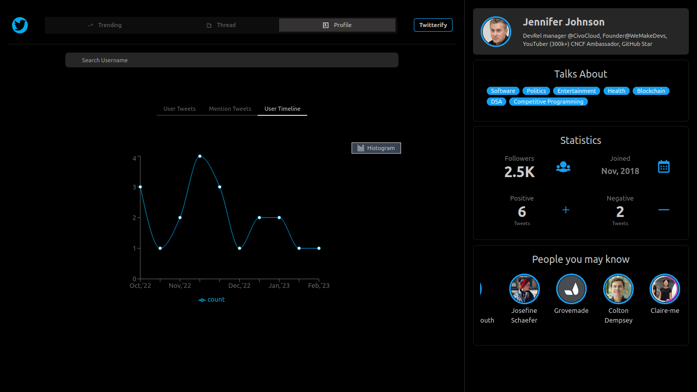
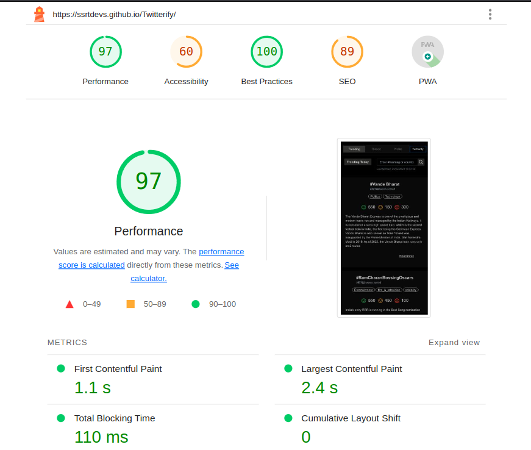

# Twitterify
*A web platform to get quick, accurate and valuable statistical insights for real time twitter data.*

### Table of contents

- [About](#about)                          
- [Why Twitterify?](#why-twitterify)                  
- [Demonstration](#demonstration)                  
- [Architecture](#project-architecture)
- [Implementation Details](#implementation-details)
- [Steps to Download and Integrate](#steps-to-download-and-integrate)
- [Tech stacks used](#tech-stacks-used)
- [Performance and Analysis](#performance-and-analysis)
- [How to contribute](#project-contributors)  

### About
- Twitterify is a web application which provides quick accurate and valuable statistical insights on real time twitter data.
- The application consists of three modules that focusses on analyzing trending data, threads and user profiles respectively.
- The application aquires real time twitter data from the twitter API's. The data is processed and then analyzed before the insights are shown to the users
- Check out the website landing page for more information: https://ssrtdevs.github.io/Twitterify-landing-page/

### Why Twitterify?
- There are over 500 million tweets tweeted per day on twitter by people to share their opinion. While many users use the platform to frequently speak their thoughts, twitter has a large passive userbase which uses the platform, mainly too read tweets and hear about people’s opinions. Often to understand the user opinion or why a particular hashtag is trending, users have to read an average of 20 tweets which can be time consuming.
- The aim of the application is to summarize trending data on twitter or data present in a lot of tweets (like threads, or a particular hashtag) and provide insightful information based on  the sentiments expressed along with the emotions involved. The application can be extremely useful for all sections to understand people’s opinions regarding the current affairs in the world effectively.

### Demonstration

#### Trending Data Analysis
- Trending Data Analysis page

- This page displays the summaries of the top 10 trends on twitter along with the percentage of sentiments involved in each one of them. Users on the platform can read a few tweets, too associated with the particular trends with the same hashtag

#### Analysis of Twitter Threads
- Thread Analysis Page

- This section displays the summary of a thread and statistical information associated with it like the no of tweets the thread consists of and the replies it has received.
- Users can enter the thread link in the input field for analyzing a particular thread
- The platform classifies a particular thread as positive or negative after evaluating its sentiments and systematically provides references for the tweets that make up the entire thread.

#### Analysis of User profiles
- Twitter User Profile Analysis Page

 

- This page extracts analyzes a particular user profile on twitter
- Ther sentiments in the user tweets are noted and a statistical figure of the positiv and negative tweets tweeted by the user is displayed.
- A word cloud is created displaying the most used words by the user.
- Other information of the user such as no of followers, the joining date of the user and the user tweets are displayed too.

### Project Architecture

### Implementation Details
- The platform uses the BART model for Abstractive Text Summarization and BERT model for Sentiment Analysis from [Hugging Face]("https://huggingface.co/")
- The [Tweepy]("https://www.tweepy.org/") library was used to extract the required tweets using the Twitter API's.
- The application conisted of 2 servers catering to the frontend and backend of the application.
- The frontend server was made using React JS and made use of data processed by the Flask server at the backend.
- The flask server soley interacted with the Twitter API's to extract data and processed it based on the corresponding requests made by the React Server at the frontend.

### Steps to Download and Integrate
1. Clone the repository from
2. The frontend and backend servers of the application run independently and need to be set up before starting them.
3. the flaskBackend folder corresponds to the flask server and the reactFrontend corresponds to the frontend server
4. Install the latest versions of Node JS and Python on the device that would be required to set up and run the application
5. To set up the flask server, open the terminal in the flaskFrontend directory and run pip install -r requirements.txt. This would install all the necessary packages for the flask server
6. To set up the flask server, open the terminal in the reactBackend directory and run npm intsall. This would install all the necessary packages for the react server
7. To run the flask server, run export FLASK_APP=sever.py and flask run subsequently on the terminal opened for the flask server. This would start the flask server on port 5000 on the localhost.
8. To run the react server, run npm start on the terminal opened for the react server. This would start the react server on port 3000 on the localhost.
9. The application then can be viewed on the browser on localhost:3000 and can be used by the users.

### Tech Stacks used
- Tech Stack used: React JS, Flask,

### Performance and Analysis

 

Twitterify has undergone rigorous testing to ensure that it meets industry standards for web development best practices. We're proud to report that our project scored a perfect 100 in the Best Practices category of the Lighthouse report. This means that our code adheres to a set of recommended

### How to Contribute

### Project Contributors
[Abhishek Sharma](https://github.com/Abhi-tech-09)

[Saket Thota](https://github.com/SaketThota)

[Shashwat Satao](https://github.com/kafka-654)

[Prithvi Rohira](https://github.com/prithvirohira8)

## Achievement
- Runner up at our college project Expo
