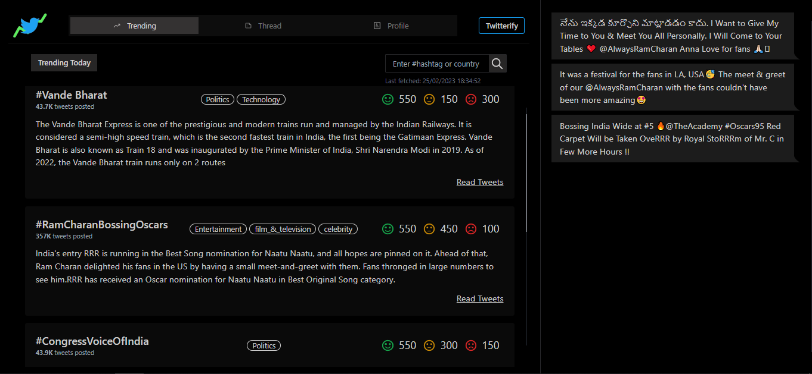

  

    
Twitterify

  

  

        
  

## *A web platform to get quick, accurate and valuable statistical insights for real time twitter data.*

---

### Table of contents

- [*A web platform to get quick, accurate and valuable statistical insights for real time twitter data.*](#a-web-platform-to-get-quick-accurate-and-valuable-statistical-insights-for-real-time-twitter-data)
  - [Table of contents](#table-of-contents)
  - [About](#about)
  - [Why Twitterify?](#why-twitterify)
  - [Demonstration](#demonstration)
    - [Trending Section](#trending-section)
    - [Thread Section](#thread-section)
    - [User Profile Section](#user-profile-section)
  - [Project Architecture](#project-architecture)
  - [Implementation Details](#implementation-details)
  - [Tech Stack](#tech-stack)
  - [Project Contributors](#project-contributors)
  - [Achievement](#achievement)

### About
- Twitterify is a web application which provides quick accurate and valuable statistical insights on real time twitter data.
- The application consists of three modules that focusses on analyzing trending data, threads and user profiles respectively.
- The application aquires real time twitter data from the twitter API's. The data is processed and then analyzed before the insights are shown to the users

### Why Twitterify?
- Twitter is a popular platform where millions of tweets are posted daily to share opinions. To comprehend user opinions or trending hashtags, users have to spend a significant amount of time reading tweets.
- The application aims to provide insightful information based on the sentiments and emotions expressed in trending Twitter data, including threads and hashtags. It can be useful for gaining a better understanding of people's opinions on current events. 

### Demonstration

#### Trending Section

- Summaries, category and sentiments of the top trends are shown
- Users can read a few tweets associated with a particular hashtag
- Search Anything feature enables users to know about any hashtag or trending topic in different geographic locations

#### Thread Section

- Displays the summary of a thread, sentiment, emtion expressed, thread lenght, replies to thread.
- Media carousel and links of the thread are provided in different sections

#### User Profile Section

 

- Ther sentiments in the user tweets are noted and a statistical figure of the positive and negative tweets tweeted by the user is displayed
- User timeline is displayed
- Word cloud is generated to showcase the most frequently used words by the user

### Project Architecture

### Implementation Details
- The platform uses the BART model for Abstractive Text Summarization and BERT model for Sentiment Analysis from [Hugging Face]("https://huggingface.co/")
- The [Tweepy]("https://www.tweepy.org/") library was used to extract the required tweets using the Twitter API's.
- The application conisted of 2 servers catering to the frontend and backend of the application.
- The frontend server was made using React JS and made use of data processed by the Flask server at the backend.
- The flask server soley interacted with the Twitter API's to extract data and processed it based on the corresponding requests made by the React Server at the frontend.

### Tech Stack
- React JS, Flask, Daisy UI, Hugging Face ML Models, Tweepy library

### Project Contributors
[Abhishek Sharma](https://github.com/Abhi-tech-09)

[Saket Thota](https://github.com/SaketThota)

[Shashwat Satao](https://github.com/kafka-654)

[Prithvi Rohira](https://github.com/prithvirohira8)

### Achievement

- Secured runner-up position at the Project Expo organized by our college.
